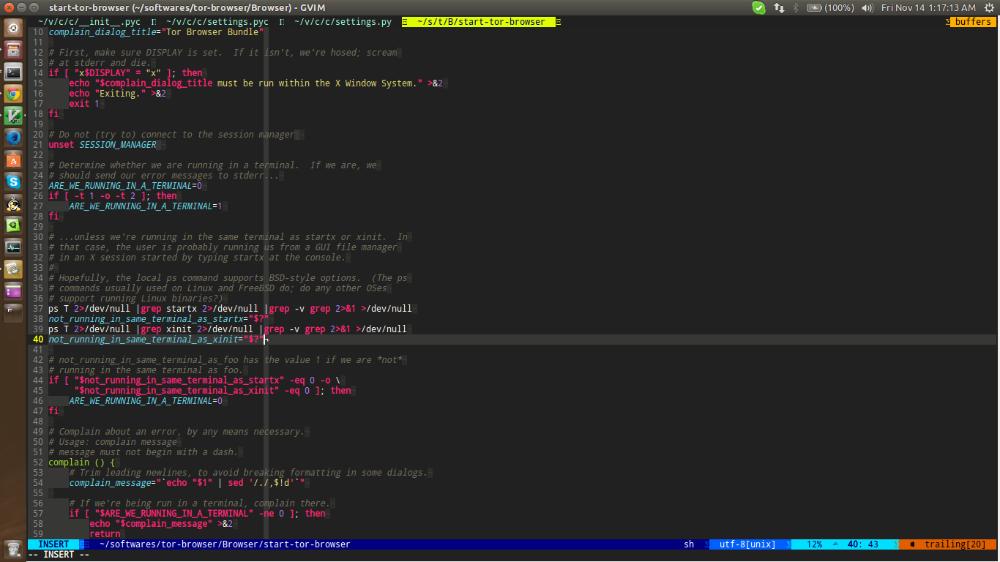

Installation
------------
If you want to fetch `master` branch :

    git clone -b master --single-branch https://github.com/modassir/my-vim.git ~/.vim

The common instructions then follow -

    git submodule update --init --recursive

*Symlinks*

    ln -s ~/.vim/.vimrc ~/.vimrc
    ln -s ~/.vim/.gvimrc ~/.gvimrc

### 
This Vim configuration uses two plugins and a program  all of which require a
little more configuration on behalf of user.
* `YouCompleteMe` plugin ( a code completion engine for vim ) requires a
compiled component. After completing steps mentioned above, please refer to
[this page] (https://github.com/Valloric/YouCompleteMe#full-installation-guide)
and follow the instructions accordingly.
* If you see strange characters in status line or improper appearance then
please install powerline fonts from
[here](https://github.com/Lokaltog/powerline-fonts). I have already included
other measures to fix this problem in the `.vimrc`. Open an issue if the problem
isn't fixed.

Screenshot
----------
The following is a screenshot of gvim with .sh file open.

Feedback
--------
Feel free to drop fork, modify or suggest any changes you like.
